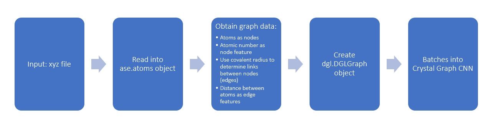
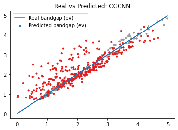

# bandgap-prediction-crystal_graph-cnn
Prediction of bandgap property of a sample of materials, using a crystal graph representation and the [Crystal Graph Convolutional Neural Network](https://arxiv.org/abs/1710.10324).
The dataset was extracted from [NOMAD 2018 Kaggle Competition](https://www.kaggle.com/c/nomad2018-predict-transparent-conductors).

Training steps:

Representation (a) and neural network (b) reproduced from the cited [article](https://arxiv.org/abs/1710.10324):

## Results

## Comments
Remarkable:
- A simple transformation from input geometry text file into crystal graph representation combining Atomic Simulation Environment and Deep Graph Library
- Quick training (maximum of around 8s per epoch)

Improvable:
- An adaptation in the node attributes has been done due to the reduced number of samples (2400 in this work, more than 10 000 in the paper), resulting in a model less general than the cited.
- The Mean Absoute Error obtained (0.2860) is similar to the cited paper, but can be improved considering the model is being tuned for a specific set of materials.
- No hyperparameter tuning has been done.
